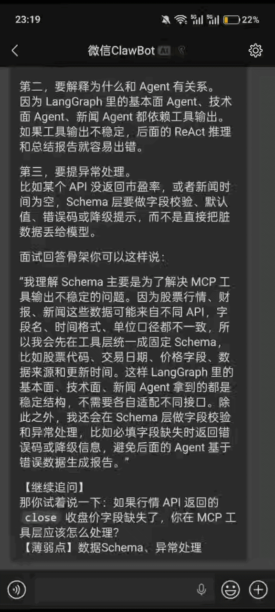

<div align="center">

# WeChat Interview Coach

### 把微信变成你的 AI 面试官

**专治 AI 应用 / Agent / RAG / MCP / LLM 工程岗 —— 读你自己的简历，动态追问，实时打分，自动复盘**

<br>



<br><br>

[](https://www.python.org/)
[](#)
[](https://openai.com/)
[](#privacy)
[](#)
[](#)

<sub><b>[快速开始](#-快速开始)</b> · <b>[为什么做](#-为什么做这个)</b> · <b>[核心玩法](#-核心玩法)</b> · <b>[指令速查](#-指令速查)</b> · <b>[隐私](#-隐私)</b></sub>

</div>

---

## 💡 为什么做这个

市面上的 AI 面试陪练要么**只会背八股**，要么**根本不看你简历**，聊两句就露馅。

**WeChat Interview Coach** 把你**本地的简历 / 项目原料**喂给大模型，在你**每天都在用的微信里**，像真正的面试官一样：

| 别的陪练 | 这个 |
|---|---|
| 题库题 → 你背答案 | **只问你简历里写过的东西**，编不出来就当场露馅 |
| "这答案不错" → 无了 | **每轮四维打分**：可信度 / 技术准确性 / 表达结构 / 风险点 |
| 聊完就聊完了 | **自动记薄弱点**：MCP、LangGraph、RAG 评估、部署、转行动机…… |
| 一次性对话 | **自动复盘 + 可背的标准答案** 沉淀到本地文件 |
| 要上网页、开新 App | **直接在微信聊**，简历 drag-and-drop 发进来就行 |
| 数据传云端 | **纯本地运行**，简历不出你的电脑 |

> 这个项目是我自己转 AI 方向时 **为自己写的**。问题都是我踩过的坑，模式都是我被拷打过的真实场景。

---

## ✨ 核心玩法

### 四个真实面试阶段

| 阶段 | 侧重 |
|---|---|
| 📞 **电话筛选面** | 自我介绍、转行动机、岗位匹配、项目概览、沟通清晰度 |
| 💻 **技术一面** | 项目链路、Agent / RAG / MCP / 后端基础、真实实现细节、排错能力 |
| 🧭 **技术二面 / 主管面** | 方案取舍、业务价值、系统边界、**项目真实性**、推进能力 |
| 🤝 **HR 面** | 动机稳定性、学习能力、抗压、地点 / 薪资 / 到岗时间 |

### 四种训练模式

| 模式 | 什么时候用 |
|---|---|
| 🧑‍🏫 **教练模式** | 基础还虚，想先补课再被追问 |
| 🧑‍💻 **技术面模式** | 模拟真实技术面节奏，标准强度 |
| 🔥 **拷打模式** | **抗压训练**，专抓名词堆砌、过度包装、项目真实性漏洞 |
| 🎯 **只面试模式** | 纯问题流，不讲解析，模拟现场 |

### 资料导入零门槛

**直接把简历甩进微信对话框**：`.docx` / `.pdf` / `.md` / `.txt` 都行。机器人自动下载、切片、入库，然后 `/生成背景` 一键生成个性化面试材料。

---

## 🚀 快速开始

**1. 装依赖**

```powershell
cd C:\path\to\wechat-interview-coach
python -m pip install -r requirements.txt
```

**2. 配 `.env`**

```env
OPENAI_API_KEY=sk-...
OPENAI_BASE_URL=https://api.openai.com/v1   # 也可以指向任意兼容端点
MODEL_NAME=gpt-4o-mini                      # 或你习惯的模型
RESUME_SOURCE_DIR=C:\path\to\your\resume_materials
```

**3. 登录微信**

```powershell
wechat-clawbot-cc setup
```

**4. 启动**

```powershell
powershell -ExecutionPolicy Bypass -File .\start_bot.ps1
# 停止： .\stop_bot.ps1    查看状态： .\status_bot.ps1
```

**5. 在微信里开聊**

```text
/资料入口          ← 查看简历入口目录
（或直接发一个 .docx / .pdf 到机器人）
/生成背景          ← 生成个性化面试材料
开始电话面          ← 走起
```

> 💡 没有微信？可以跑 `python cli_chat.py` 直接在命令行里面试。

---

## 🎛️ 指令速查

<table>
<tr><th>类别</th><th>指令</th><th>说明</th></tr>
<tr><td rowspan="3"><b>资料</b></td>
    <td><code>/资料入口</code></td><td>查看简历入口目录</td></tr>
<tr><td><code>/导入资料 &lt;路径&gt;</code></td><td>切换简历目录</td></tr>
<tr><td><code>/生成背景</code></td><td>生成 <code>AI面试背景材料.generated.md</code></td></tr>
<tr><td rowspan="4"><b>阶段</b></td>
    <td><code>开始电话面</code></td><td>进入电话筛选</td></tr>
<tr><td><code>开始一面</code></td><td>技术一面</td></tr>
<tr><td><code>开始二面</code></td><td>技术二面 / 主管面</td></tr>
<tr><td><code>开始HR面</code></td><td>HR 面</td></tr>
<tr><td rowspan="4"><b>模式</b></td>
    <td><code>/模式 教练</code></td><td>补基础 + 追问</td></tr>
<tr><td><code>/模式 技术面</code></td><td>标准技术面节奏</td></tr>
<tr><td><code>/模式 拷打</code></td><td>🔥 高压追问</td></tr>
<tr><td><code>/模式 只面试</code></td><td>纯问题流</td></tr>
<tr><td rowspan="5"><b>训练</b></td>
    <td><code>/拷打 &lt;项目名&gt;</code></td><td>进入拷打模式并追问指定项目</td></tr>
<tr><td><code>/解释 &lt;概念&gt;</code></td><td>先补基础，再给面试追问</td></tr>
<tr><td><code>/今日弱点</code></td><td>查看累计薄弱点</td></tr>
<tr><td><code>/复盘</code></td><td>生成复盘文件</td></tr>
<tr><td><code>/标准答案</code></td><td>把最近一轮沉淀成可背答案</td></tr>
<tr><td rowspan="3"><b>其他</b></td>
    <td><code>/帮助</code></td><td>帮助</td></tr>
<tr><td><code>/刷新</code></td><td>重新读取简历资料</td></tr>
<tr><td><code>/重置</code></td><td>清空当前对话记忆</td></tr>
</table>

---

## 🧱 是怎么跑起来的

```
     微信消息                     本地大脑
   ┌─────────┐   inbound    ┌──────────────────┐
   │  你发的  │ ───────────▶│  wechat_channel  │
   │  问题/  │              │   (wechat-       │
   │  简历   │              │    clawbot)      │
   └─────────┘              └────────┬─────────┘
                                     │
            ┌────────────────────────┼────────────────────────┐
            ▼                        ▼                        ▼
      ┌──────────┐           ┌──────────────┐         ┌──────────────┐
      │ commands │           │   engine     │         │  materials   │
      │  指令路由 │           │  面试追问 +  │         │ 简历切片 +   │
      │          │           │  四维打分    │         │ 上下文检索   │
      └────┬─────┘           └──────┬───────┘         └──────┬───────┘
           │                        │                        │
           └──────────┬─────────────┴────────────┬───────────┘
                     ▼                          ▼
              ┌─────────────┐            ┌─────────────┐
              │  sessions   │            │   corpus    │
              │  .json      │            │   cache     │
              │  (历史+弱点)│            │  (你的简历) │
              └─────────────┘            └─────────────┘
                     │
                     ▼
              📁 reviews/ + answers/   （自动复盘 & 可背答案）
```

**技术栈**：Python 3.10+ · OpenAI 兼容 API · `wechat-clawbot` 桥接微信 · 本地 JSON / 文件持久化，零外部依赖。

---

## 🗺️ Roadmap

- [x] 微信原生对话 + 文件直发入库
- [x] 四阶段 × 四模式动态面试协议
- [x] 四维打分 + 薄弱点累计
- [x] 自动复盘 + 标准答案沉淀
- [ ] 语音面试模式（TTS + STT）
- [ ] 面试录音回放 & 带标注的 timeline 视图
- [ ] 行业岗位包（算法岗 / 后端岗 / 大模型训练岗）
- [ ] Web dashboard：可视化进步曲线

欢迎 issue / PR。

---

## 🔒 隐私

这个项目**设计上就是本地跑的**：

- ✅ 简历、对话、复盘、答案 **全部留在你本机**
- ✅ 只有**你主动发给模型的那部分内容**会走 OpenAI 兼容 API
- ❌ **不要 commit**：`.env`、`sessions.json`、`interview_corpus_cache.json`、`reviews/`、`answers/`、日志、微信凭证、API Key、真实简历

> 本项目仅用于个人学习和本地面试训练。微信连通性依赖 `wechat-clawbot` 和上游行为，上游变化可能导致失效。**请勿**用于群发、商业自动化或违反平台条款的场景。

---

## 🤝 贡献

这个项目诞生于一个转行 AI 的人的真实焦虑。如果它也帮到你，欢迎：

- ⭐ Star —— 最直接的鼓励
- 🐛 开 Issue 讲你踩的坑
- 🔧 PR 你觉得面试官"就该这么问"的追问策略
- 📣 把它推给同样在刷 AI 岗的朋友

---

<div align="center">

**如果它帮你拿到了 offer，记得回来说一声。** 🎉

<sub>Built for the career switchers who refuse to recite interview question banks.</sub>

</div>
